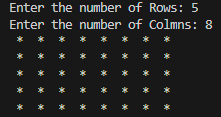
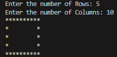
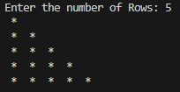

# Patterns-Java

Here you'll find various patterns that is implemented in JAVA programming language

<h2>Contents</h2>
<ul>
  <li>
    <strong>Solid Rectangle Pattern</strong> 
    
  </li>
  <li>
    <strong>Hollow Rectangle Pattern</strong> 
    
  </li>
  <li>
    <strong>Right Half Pyramid</strong> 
    
  </li>
</ul>
